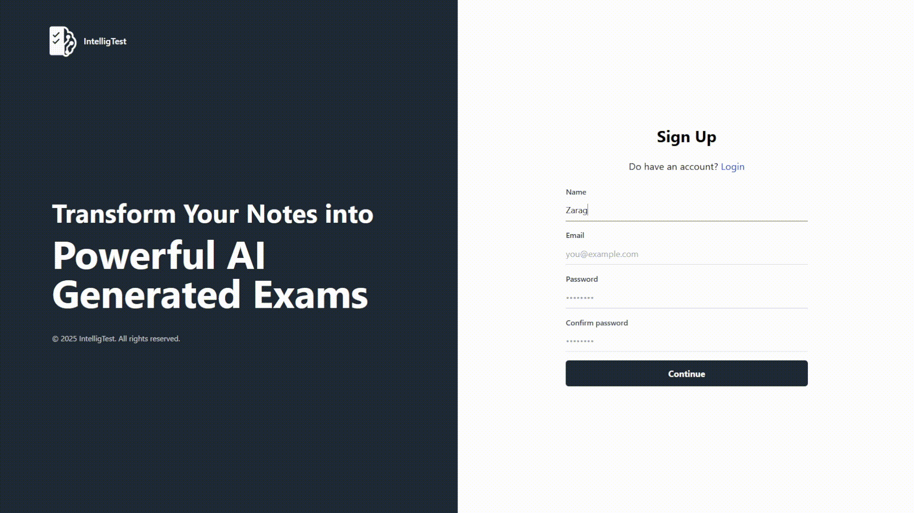
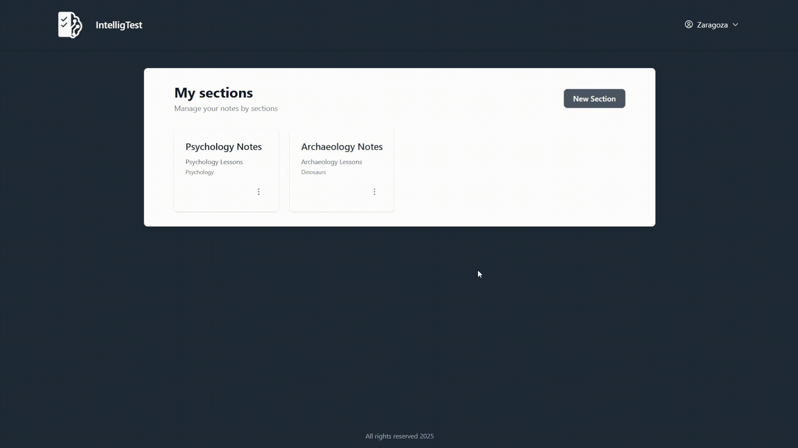
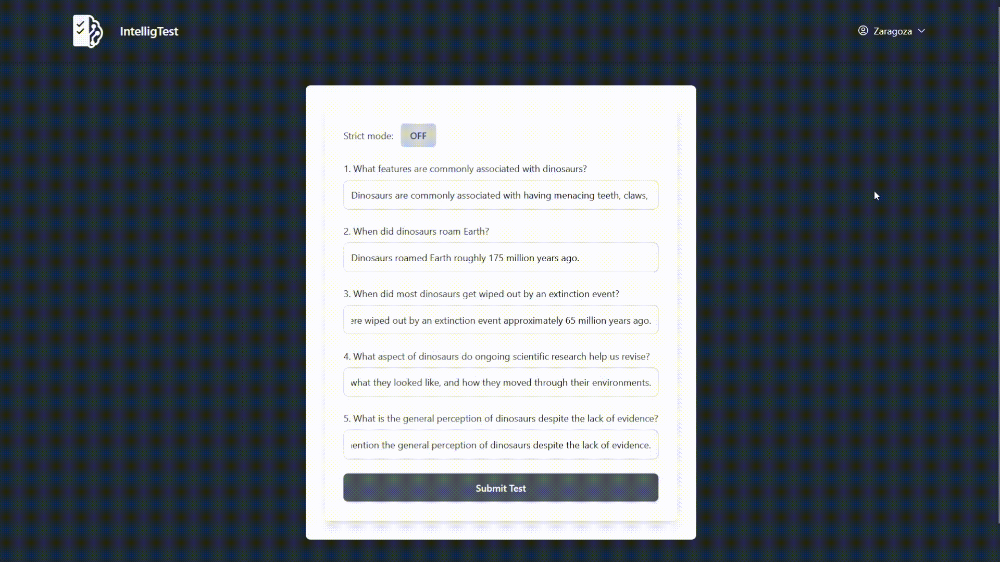
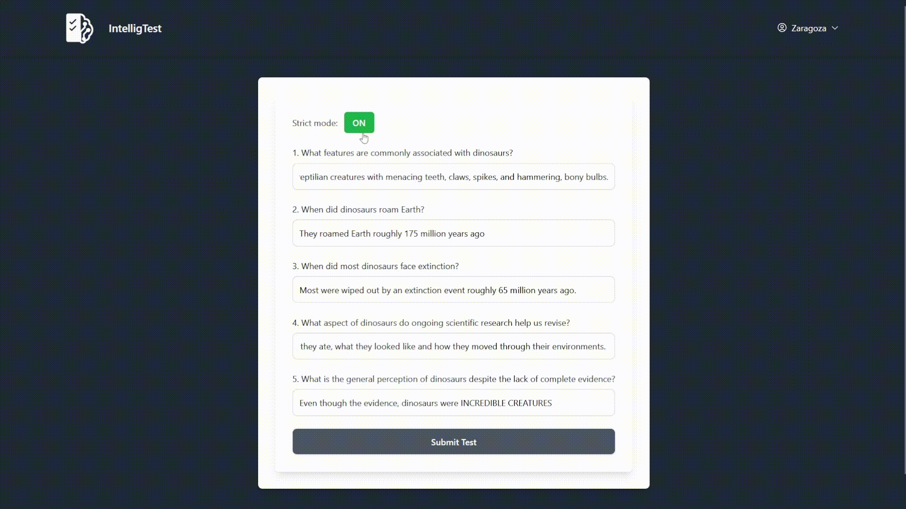
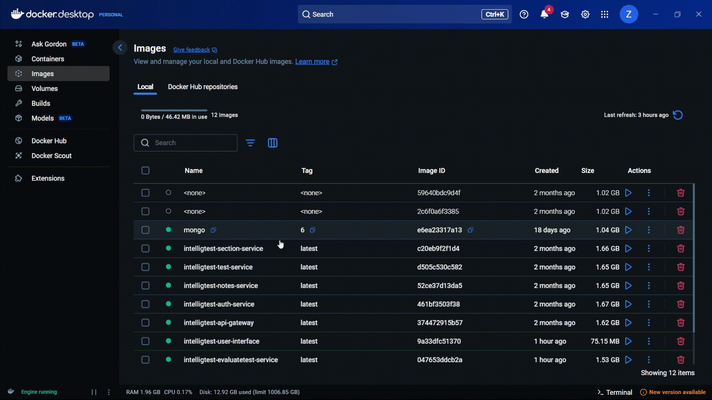

## Overview
IntelligTest is a next-generation AI-powered platform that transforms the way educational assessments are created and delivered. By converting student notes into personalized, automated exams, it streamlines the entire process—from content input to secure evaluation and insightful feedback. More than just a tool for education, IntelligTest is a showcase of expertise in AI integration, full-stack development, and cloud orchestration, demonstrating the ability to build innovative, end-to-end solutions that are both technically robust and user-focused.

## Note
I{ve taken this microservices platform to the next level-migrating from Docker Compose to pure Kubernetes for cleaner, production-grade orchestration. The journey doesn't stop here: the next milestone is deploying on Amazon EKS to unlock cloud-navigate scalability and reliability. Additionally, I'm working on new features such as UI update, statistics, timer, AI recommendations and reminders based on forgetting curve, simulation based on teacher's evaluation and more. Saty tuned, big thins are coming! 

## Demo Views
Explore the core functionalities of the IntelligTest microservices system through these engaging animated demos. Each GIF highlights a specific feature, demonstrating how the platform streamlines authentication, orchestration, evaluation modes, and content extraction for an efficient and user-friendly experience.

### Authentication Process
This demo illustrates the seamless authentication workflow, enabling users to create accounts, log in securely, recover forgotten passwords, and reconfirm unverified accounts—all designed for accessibility and robust security.



### Notes Extraction and Customization
Discover how IntelligTest intelligently extracts key information from screenshots or photos of student notes. Users can then refine the extracted data before effortlessly generating automated tests, empowering educators with smart, customizable tools.



### Non-Strict Mode Evaluation
Experience the flexible non-strict evaluation mode, where answers are deemed correct if they semantically align with the expected response, even without exact matches. In contrast, strict mode demands precise equivalence, offering versatility for varied assessment needs.



### Strict Mode Evaluation
This demo showcases the rigorous strict evaluation mode, requiring answers to match expected responses verbatim for accuracy. Unlike non-strict mode's meaning-based flexibility, it ensures precision in high-stakes evaluations.



### Docker Compose Orchestration
Witness the efficient execution of Docker containers via Compose for rapid orchestration. This setup facilitates quick demos, with upcoming enhancements including UI refinements, unit testing, advanced security measures, migration from a custom API Gateway to AWS Cognito, and full-scale deployment using Kubernetes, Grafana, Prometheus, and other AWS services.



## Features
- **Note Upload and Text Extraction**: Upload images or screenshots of notes; extract text using Google Cloud Vision AI.
- **AI-Driven Test Generation**: Generate customized questions from extracted notes via GPT.
- **Test Taking and Evaluation**: Answer generated tests with options for strict or relaxed evaluation modes.
- **User Authentication**: Secure registration, login, and JWT-based authorization.
- **Note and Test Management**: Edit extracted notes, organize into sections, and store test data.
- **Feedback and Scoring**: Automated evaluation of answers with detailed feedback.
- **Microservices Design**: Independent services for modularity and scalability.
- **Containerization**: Docker Compose for simplified deployment and orchestration.

## Tech Stack

### Overall
- **Architecture**: Microservices with API Gateway for routing.
- **Containerization**: Docker and Docker Compose.
- **Authentication**: JWT (JSON Web Tokens).
- **AI Integrations**: Google Cloud Vision API, OpenAI GPT API.
- **Databases**: Likely MongoDB or similar for each service (inferred from typical Node.js setups).
- **Languages**: TypeScript/JavaScript.

### Backend (Microservices)
- Node.js with Express.js.
- RESTful APIs for inter-service communication.

### Frontend
- React with Vite for fast development and building.
- Tailwind CSS or similar for styling (inferred from common practices).

## Microservices Architecture

IntelligTest employs a microservices architecture to break down the application into independent, loosely coupled services. Each service handles a specific domain responsibility, allowing for independent development, scaling, and deployment. Communication between services is facilitated through the API Gateway, which handles routing, authentication, and load balancing. Services interact via HTTP/REST APIs, with JWT tokens ensuring secure access. This design promotes resilience, as failure in one service does not affect others, and enables easier maintenance and updates.

The architecture includes:
- **API Gateway**: Central entry point for all client requests.
- **Core Services**: Authentication, note handling, text extraction, test generation, evaluation, and storage.
- **Orchestration**: Docker Compose manages container lifecycles and networking.
- **Inter-Service Communication**: Synchronous HTTP calls; potential for asynchronous messaging in future expansions.

## Services

Each service is containerized and can be developed/tested independently. Below is a detailed breakdown of each service, including its purpose, key features, technologies, and internal structure (based on standard Node.js/Express patterns).

### API Gateway
- **Purpose**: Acts as the single entry point for all external requests, routing them to appropriate microservices while validating JWT tokens for security.
- **Key Features**: Request routing, authentication middleware, rate limiting (if implemented), and error handling.
- **Technologies**: Node.js, Express.js, JWT verification libraries.
- **Internal Structure**:
  ```
  api-gateway/
  ├── src/
  │   ├── config/          # Configuration for routes and services
  │   ├── middleware/      # Authentication and validation logic
  │   ├── routes/          # Proxy routes to other services
  │   └── server.ts        # Main entry point
  ├── .env                 # Environment variables (e.g., service URLs, JWT secrets)
  ├── Dockerfile           # Docker build instructions
  ├── package.json         # Dependencies (express, jsonwebtoken, etc.)
  └── tsconfig.json        # TypeScript config (if using TS)
  ```

### Auth Service
- **Purpose**: Manages user authentication, including registration, login, token issuance, and password management.
- **Key Features**: User signup/login, JWT token generation/refresh, email verification (if applicable).
- **Technologies**: Node.js, Express.js, bcrypt for hashing, JWT for tokens, possibly Mongoose for user models.
- **Internal Structure**:
  ```
  auth-service/
  ├── src/
  │   ├── controllers/     # Handlers for auth endpoints
  │   ├── models/          # User schema (e.g., MongoDB models)
  │   ├── routes/          # API routes for /register, /login, etc.
  │   └── server.ts        # Server setup
  ├── .env                 # DB URI, JWT secrets
  ├── Dockerfile
  ├── package.json
  └── tsconfig.json
  ```

### Notes Service
- **Purpose**: Handles the uploading, storage, and editing of student notes after text extraction.
- **Key Features**: File upload handling, note editing, persistence in database.
- **Technologies**: Node.js, Express.js, Multer for file uploads, database ORM.
- **Internal Structure**:
  ```
  notes-service/
  ├── src/
  │   ├── controllers/     # Logic for note CRUD operations
  │   ├── models/          # Note schemas
  │   ├── routes/          # Endpoints for /upload, /edit
  │   └── server.ts
  ├── .env
  ├── Dockerfile
  ├── package.json
  └── tsconfig.json
  ```

### Extract Text Service
- **Purpose**: Interfaces with Google Cloud Vision AI to extract text from uploaded note images.
- **Key Features**: Image processing, API calls to Google Vision, text parsing and return.
- **Technologies**: Node.js, Express.js, @google-cloud/vision library.
- **Internal Structure**:
  ```
  extracttext-service/
  ├── src/
  │   ├── controllers/     # Extraction logic
  │   ├── routes/          # Endpoint for /extract
  │   └── server.ts
  ├── .env                 # Google API keys
  ├── Dockerfile
  ├── package.json
  └── tsconfig.json
  ```

### Generate Test Service
- **Purpose**: Utilizes GPT to generate exam questions based on extracted notes.
- **Key Features**: Prompt engineering for GPT, question formatting, variety in question types.
- **Technologies**: Node.js, Express.js, OpenAI API client.
- **Internal Structure**:
  ```
  generatetest-service/
  ├── src/
  │   ├── controllers/     # GPT integration and question generation
  │   ├── routes/          # Endpoint for /generate
  │   └── server.ts
  ├── .env                 # OpenAI API keys
  ├── Dockerfile
  ├── package.json
  └── tsconfig.json
  ```

### Test Service
- **Purpose**: Orchestrates the overall test generation process and stores test data.
- **Key Features**: Test creation, storage, retrieval, integration with other services.
- **Technologies**: Node.js, Express.js, database for test persistence.
- **Internal Structure**:
  ```
  test-service/
  ├── src/
  │   ├── controllers/     # Test management logic
  │   ├── models/          # Test schemas
  │   ├── routes/          # Endpoints for /create, /get
  │   └── server.ts
  ├── .env
  ├── Dockerfile
  ├── package.json
  └── tsconfig.json
  ```

### Evaluate Test Service
- **Purpose**: Evaluates student answers against generated tests, providing scores and feedback.
- **Key Features**: Answer comparison (strict/relaxed modes), scoring algorithms, feedback generation.
- **Technologies**: Node.js, Express.js, possibly NLP for relaxed evaluation.
- **Internal Structure**:
  ```
  evaluatetest-service/
  ├── src/
  │   ├── controllers/     # Evaluation logic
  │   ├── routes/          # Endpoint for /evaluate
  │   └── server.ts
  ├── .env
  ├── Dockerfile
  ├── package.json
  └── tsconfig.json
  ```

### Section Service
- **Purpose**: Manages logical groupings or sections for notes and tests.
- **Key Features**: Section creation, assignment of notes/tests to sections.
- **Technologies**: Node.js, Express.js, database models.
- **Internal Structure**:
  ```
  section-service/
  ├── src/
  │   ├── controllers/     # Section CRUD
  │   ├── models/          # Section schemas
  │   ├── routes/          # Endpoints for sections
  │   └── server.ts
  ├── .env
  ├── Dockerfile
  ├── package.json
  └── tsconfig.json
  ```

### User Interface (Frontend)
- **Purpose**: Provides the React-based frontend for user interactions, including dashboards for notes, tests, and results.
- **Key Features**: Responsive UI, forms for uploads/answers, real-time feedback.
- **Technologies**: React, Vite, TypeScript, Axios for API calls, possibly Tailwind CSS.
- **Internal Structure**:
  ```
  user-interface/
  ├── src/
  │   ├── components/      # Reusable UI components (e.g., UploadForm, TestViewer)
  │   ├── hooks/           # Custom hooks for state management, API fetching
  │   ├── pages/           # Page components (e.g., Dashboard, TestPage)
  │   ├── api/             # API service wrappers
  │   └── main.tsx         # App entry point
  ├── .env                 # VITE_API_URL for gateway
  ├── index.html
  ├── vite.config.ts
  ├── package.json
  └── tsconfig.json
  ```

## Project Structure

The repository is organized around microservices, with each service in its own directory:

```
IntelligTest/
├── api-gateway/             # API routing and security
├── auth-service/            # User authentication
├── evaluatetest-service/    # Test evaluation
├── extracttext-service/     # Text extraction via Google Vision
├── generatetest-service/    # Question generation via GPT
├── notes-service/           # Note management
├── section-service/         # Section organization
├── test-service/            # Test orchestration and storage
├── user-interface/          # React frontend
├── docker-compose.yml       # Container orchestration
└── README.md                # Project documentation
```

## Setup and Installation

### Prerequisites
- Node.js (v18+)
- Docker and Docker Compose
- API keys for Google Cloud Vision and OpenAI
- Database setup (e.g., MongoDB Atlas)

### Steps
1. Clone the repository:
   ```
   git clone https://github.com/Sebastian-Zaragoza/IntelligTest.git
   cd IntelligTest
   ```

2. Configure Environment Variables:
   - For each service, copy `.env.example` to `.env` and fill in values (e.g., API keys, DB URIs, JWT secrets).

3. Build and Run with Docker:
   ```
   docker-compose up --build
   ```
   - This starts all services and the frontend (accessible at http://localhost:3000 or configured port).

4. Alternative: Run Individually (for development)
   - Navigate to each service folder, run `npm install` and `npm run dev`.

## Usage

- **Register/Login**: Create an account via the frontend.
- **Upload Notes**: Submit images; text is extracted and editable.
- **Generate Test**: Select notes to create a custom exam.
- **Take Test**: Answer questions; submit for evaluation.
- **View Results**: Get scores and feedback.

All interactions route through the API Gateway for security.

## License

MIT License. See [LICENSE](LICENSE) for details.

## Contact

For inquiries, contact Sebastian Zaragoza via GitHub or email (galindozaragozasebastian@gmail.com).

Thank you for exploring IntelligTest! 📚✨
